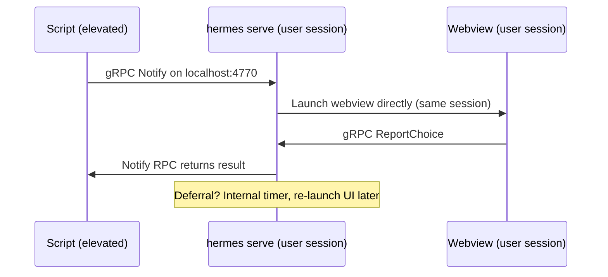

# Architecture

## Design principle

The notification UI is a web page, not a native dialog. HTML, CSS, and JavaScript are compiled into the Go binary via `embed` and rendered through [Wails v2](https://wails.io) in a platform-native webview (WebView2 on Windows, WKWebView on macOS, WebKitGTK on Linux). This means one UI codebase that looks identical on every OS, styled with standard web tech, with zero external dependencies at runtime.

### Key dependencies

| Library | Role |
|---------|------|
| [Wails v2](https://wails.io) | Frameless webview with Go<->JS bindings |
| [Cobra](https://github.com/spf13/cobra) | CLI framework (flags, subcommands, help) |
| [google/deck](https://github.com/google/deck) | Structured logging (stderr, Windows Event Log, syslog) |
| [gRPC](https://grpc.io) | Service<->CLI and service<->UI communication |
| [fsnotify](https://github.com/fsnotify/fsnotify) | Cross-platform filesystem event monitoring |

---

## Service daemon architecture

hermes runs as a **per-user** service daemon (`hermes serve`) in the user's desktop session. Because it's already in the user's session, it launches webviews directly — no privilege escalation or session-crossing tools needed.



---

## Notification lifecycle

1. **Submit** — CLI sends config via `Notify` RPC. Manager generates an ID, stores the notification, and blocks the RPC.
2. **Dependency check** — If `depends_on` is set, the notification enters `waiting_on_dependency` state until the dependency completes.
3. **Quiet hours check** — If `quiet_hours` is configured and the current time falls within the window, the manager sleeps until the window ends. Deadlines are still enforced while waiting.
4. **DND check** — Before launching the UI, the manager checks OS Do Not Disturb status. With `dnd=respect` (default), it polls every 60s until DND clears. With `dnd=ignore`, it proceeds immediately. With `dnd=skip`, it completes with `"dnd_active"`.
5. **Launch** — Service launches a UI subprocess directly (same user session).
6. **Response** — User clicks a button. UI reports choice via `ReportChoice` RPC. `Notify` RPC unblocks and returns the value.
7. **Defer + Escalation** — User defers. Manager increments defer count, starts an internal timer, and re-launches the UI when the timer fires. If `escalation` thresholds are configured, the notification's appearance and timeout mutate progressively (shorter timeout, warning color, urgency text).
8. **Action chaining** — When the notification completes, the manager checks `result_actions` for a mapping from the user's response value to an automatic action (`cmd:` or `url:` prefix). The action is dispatched server-side.
9. **Deadline** — If `defer_deadline` is set and the deadline passes, the notification auto-actions with `timeout_value`. Deadlines are enforced even while waiting for DND or quiet hours to clear.
10. **Cancel** — External `Cancel` RPC removes the notification and unblocks the `Notify` RPC.

---

## Deferral management

- **DeferDeadline**: Maximum time from first notification (e.g., `"24h"`, `"7d"`). After this, no more deferrals.
- **MaxDefers**: Maximum number of defer actions. 0 = unlimited (until deadline).
- **Re-notification**: When a defer timer fires, the service re-launches the UI subprocess directly.
- **Deadline enforcement**: If the deadline passes while deferred, the next re-show attempt auto-actions instead.

### Escalation ladder

The `escalation` array defines progressive urgency steps that mutate the notification each time the user defers past a threshold. The highest matching step (by `after_defers`) wins.

| Field | Effect |
|-------|--------|
| `after_defers` | Minimum defer count to activate this step |
| `timeout` | Override `TimeoutSeconds` (shorter = more urgent) |
| `accent_color` | Override accent color (e.g. orange then red) |
| `message_suffix` | Appended to the message body (urgency warning text) |

Escalation is applied in the manager before each re-show, so the user sees progressively more urgent versions of the same notification. See `testdata/escalation-restart.json` for a working example.

---

## Action chaining

The `result_actions` map connects user responses to automatic follow-up actions. When a notification completes with a value that matches a key in `result_actions`, the manager dispatches the corresponding action server-side.

```json
{
  "result_actions": {
    "restart": "cmd:shutdown /r /t 60",
    "wiki": "url:https://wiki.example.com/vpn-troubleshooting"
  }
}
```

Supported action prefixes: `cmd:` (shell command), `url:` (opens in default browser / system handler). The action runs in the service daemon process, not the UI subprocess.

> **Security note:** `cmd:` actions execute with the same privileges as the `hermes serve` process (the logged-in user). Only trusted configs should define `result_actions`. Configs are validated on enqueue and drain, but the shell command itself is passed to `sh -c` / `cmd /C` without further sandboxing.

---

## Quiet hours

The `quiet_hours` object defines a daily window during which notifications are delayed (like DND, but time-based). The manager sleeps until the quiet window ends, then proceeds with the normal DND check.

```json
{
  "quiet_hours": {
    "start": "22:00",
    "end": "07:00",
    "timezone": "America/Los_Angeles"
  }
}
```

- **Overnight ranges** are supported (start > end wraps past midnight).
- **Timezone** defaults to the local system timezone if omitted.
- **Deadlines** are still enforced during quiet hours — a notification will auto-action if its deadline passes.

---

## Localization

Notifications support localized heading and message text via `heading_localized` and `message_localized` maps. Keys are BCP-47-style language codes (e.g. `"ja"`, `"de"`, `"es"`).

```json
{
  "heading": "Restart Required",
  "heading_localized": { "ja": "再起動が必要です", "de": "Neustart erforderlich" },
  "message": "Please restart to apply updates.",
  "message_localized": { "ja": "アップデートを適用するため再起動してください。" }
}
```

At runtime, the locale is resolved in this order:
1. `--locale` CLI flag (explicit override)
2. `HERMES_LOCALE` environment variable
3. `LANG` / `LC_MESSAGES` / `LANGUAGE` environment variables
4. Falls back to `"en"` (uses the base `heading` and `message`)

Matching tries exact code, then prefix (`"ja"` matches `"ja-JP"` key), then reverse prefix (`"ja-JP"` locale matches `"ja"` key).

---

## Notification dependencies

The `depends_on` field creates a sequential workflow: notification B is held in a `waiting_on_dependency` state until notification A (identified by `depends_on` ID) completes.

```json
[
  { "id": "accept-eula", "heading": "Accept EULA", ... },
  { "id": "apply-update", "depends_on": "accept-eula", "heading": "Install Update", ... }
]
```

When the dependency completes, all waiting notifications are unblocked and proceed through the normal quiet-hours / DND / launch pipeline. Dependencies are checked against both the active notification set and the history store.

---

## Priority

The `priority` field (0-10, default 5) controls delivery order when multiple notifications are pending. Higher values are shown first. Priority affects:

- **Offline queue drain**: queued notifications are sorted by priority (descending), then by queue time (oldest first within the same priority).
- **Future**: priority will control preemption of lower-priority active notifications.

### Persistence {#persistence}

Deferral state is persisted to a local [bbolt](https://github.com/etcd-io/bbolt) database (single file, zero config). On startup, `hermes serve` restores any in-flight notifications and re-shows them immediately.

| Platform | Default DB path |
|----------|-----------------|
| Windows  | `%LOCALAPPDATA%\hermes\hermes.db` |
| macOS    | `~/Library/Application Support/hermes/hermes.db` |
| Linux    | `$XDG_DATA_HOME/hermes/hermes.db` (or `~/.local/share/hermes/hermes.db`) |

Override with `hermes serve --db /path/to/hermes.db`.

**What survives a restart:** notification config, defer count, deadline, state. **What doesn't:** in-memory timer offsets (restored notifications are re-shown immediately on startup rather than waiting for the remaining deferral period).

### History

When a notification completes (user action, timeout, or cancellation), the manager saves a `HistoryRecord` to a separate `history` bbolt bucket. This powers the inbox feature (`hermes inbox`).

On startup, the service prunes history records older than 30 days or exceeding 50 entries. The `PruneHistory` method enforces both age and count limits in a single pass.

### Offline queue {#offline-queue}

When the service daemon is not running (user on leave, machine off, session ended), `hermes notify` falls back to writing the notification config into a `queue` bbolt bucket in the same database file. The DB lock acts as a natural mutex: if the daemon holds it, the queue write fails and the original gRPC error is returned (the service IS running, so the error is "real"). If the DB is unlocked, the daemon is truly down and the notification is persisted for later.

On the next `hermes serve` startup, the queue is drained serially — one notification at a time with a 30-second pause between each. This prevents overwhelming a user who returns after extended absence (e.g., paternity leave) with dozens of notifications at once.

| Behavior | Detail |
|----------|--------|
| Queue TTL | 30 days (notifications older than this are expired on drain) |
| Drain order | Priority (highest first), then oldest within same priority |
| Drain pacing | Show one → wait for user response → 30s pause → next |
| Dedup | Same notification ID is only queued once |
| Exit code | `hermes notify` exits with **203** when queued (stdout: `queued`) |
| Expired records | Saved to history as `expired_while_queued` |
| Crash safety | Queue record deleted before submit (at-most-once delivery) |

---

## Packages

```
hermes/
├── main.go                        Thin entry point (embed + logging + cmd.Execute)
├── cmd/                           Cobra CLI commands
│   ├── root.go                    Root command, mode routing, runUI, respond
│   ├── serve.go                   Per-user service daemon (gRPC server + manager)
│   ├── launch.go                  Subprocess launcher for re-show
│   ├── notify.go                  Send notification via gRPC
│   ├── list.go                    List active notifications
│   ├── cancel.go                  Cancel a notification
│   ├── inbox.go                   View notification history (UI or JSON)
│   ├── install.go                 MOTD hook setup (called by package installers)
│   ├── uninstall.go               MOTD hook cleanup
│   ├── sessionlaunch_windows.go   Win32 CreateProcessAsUser for per-user daemon launch
│   ├── sessionlaunch_unix.go      Unix SysProcAttr.Credential for per-user daemon launch
│   ├── demo.go                    Demo subcommand and config
│   └── version.go                 Version/build-date vars and subcommand
│
├── proto/                         Protobuf/gRPC definitions
│   ├── hermes.proto               Service definition
│   ├── hermes.pb.go               Generated message code
│   └── hermes_grpc.pb.go          Generated gRPC code
│
├── internal/
│   ├── app/                       Wails App struct, Go<->JS bindings, window positioning
│   ├── auth/                      Per-session token auth (generate, validate, gRPC interceptor)
│   ├── client/                    gRPC client (CLI + UI subprocess)
│   ├── config/                    JSON config, types, validation, deferral parsing
│   ├── logging/                   Platform-specific log backends
│   │   ├── unix.go                syslog (macOS/Linux)
│   │   └── windows.go             Windows Event Log
│   ├── dnd/                       Do Not Disturb detection (per-platform)
│   ├── manager/                   Notification lifecycle (state, deferrals, deadlines, DND)
│   ├── ratelimit/                 Token-bucket rate limiter for gRPC RPCs
│   ├── server/                    gRPC server implementation
│   ├── store/                     bbolt persistence (deferral state + offline queue)
│   ├── action/                    Button value dispatch (url:, cmd:, ms-settings:, x-apple.systempreferences:)
│   └── watch/                     Filesystem monitoring (fsnotify wrapper)
│
├── frontend/                      The web UI (embedded into binary)
│   ├── index.html                 Notification layout
│   ├── style.css                  Dark theme, CSS custom properties
│   └── main.js                    Countdown, dropdowns, Wails bindings
│
├── build/                         Wails build metadata (icons, manifest)
├── assets/                        Source artwork (logo, screenshots)
└── docs/                          Documentation
```

The `internal/` packages import only Go stdlib and each other — no Wails dependency except `internal/app`. This means `go test ./internal/...` works without Node.js, WebKit, or a display server.

---

## gRPC transport

All IPC uses gRPC over TCP on `127.0.0.1:4770` (configurable via `--port`). No TLS — localhost only. The service binds to the loopback interface exclusively.

### Authentication

On startup, `hermes serve` generates a 32-byte cryptographically random session token and writes it to a platform-specific path with `0600` permissions:

| Platform | Token path |
|----------|------------|
| Windows  | `%LOCALAPPDATA%\hermes\session.token` |
| macOS    | `~/Library/Application Support/hermes/session.token` |
| Linux    | `$XDG_RUNTIME_DIR/hermes/session.token` (or `$XDG_DATA_HOME/hermes/session.token`) |

Every gRPC call must include the token in the `authorization` metadata header. The client auto-loads the token from disk on `Dial`. The token is deleted on service shutdown.

This prevents blind port-scanning processes from interacting with the service. Only processes that can read the user's token file (same UID, `0600`) can send or read notifications.

### Capacity limits

The service accepts at most 10 active notifications (showing, deferred, or waiting on a dependency). New `Notify` submissions are rejected with exit code `1` when at capacity. This prevents compromised automation from flooding the user's desktop.

### Rate limiting

The `Notify` RPC is rate-limited to a burst of 5 with a refill rate of 1/second. This prevents runaway scripts from spamming the user with notifications. Other RPCs (List, Cancel, etc.) are not rate-limited.

RPCs:

| RPC | Direction | Purpose |
|-----|-----------|---------|
| `Notify` | CLI → Service | Submit notification, block for result |
| `GetUIConfig` | UI → Service | Fetch config for a notification ID |
| `ReportChoice` | UI → Service | Report user action |
| `Cancel` | CLI → Service | Cancel an active notification |
| `List` | CLI → Service | List active notifications |
| `ListHistory` | CLI → Service | Retrieve completed notification history |

---

## Deployment {#deployment}

The service daemon runs **per-user** — each user who needs notifications should have `hermes serve` running in their desktop session. When `hermes install` runs elevated (e.g. from a package postinstall script), it launches the daemon in all active user sessions immediately via native OS APIs. The HKLM Run key (Windows), LaunchAgent (macOS), and systemd user unit (Linux) handle autostart on subsequent logins. See **[Platforms — Deployment](platforms.md#deployment)** for the full matrix.

### Windows

Add a registry Run key (per-user, no admin required):

```powershell
New-ItemProperty -Path "HKCU:\Software\Microsoft\Windows\CurrentVersion\Run" `
  -Name "Hermes" -Value '"C:\Program Files\Hermes\hermes.exe" serve' -PropertyType String
```

### macOS

Drop a LaunchAgent plist into `~/Library/LaunchAgents/`:

```xml
<?xml version="1.0" encoding="UTF-8"?>
<!DOCTYPE plist PUBLIC "-//Apple//DTD PLIST 1.0//EN" "http://www.apple.com/DTDs/PropertyList-1.0.dtd">
<plist version="1.0">
<dict>
  <key>Label</key><string>com.tseknet.hermes</string>
  <key>ProgramArguments</key>
  <array>
    <string>/usr/local/bin/hermes</string>
    <string>serve</string>
  </array>
  <key>RunAtLoad</key><true/>
  <key>KeepAlive</key><true/>
</dict>
</plist>
```

### Linux

Create a systemd user unit at `~/.config/systemd/user/hermes.service`:

```ini
[Unit]
Description=Hermes notification service

[Service]
ExecStart=/usr/local/bin/hermes serve
Restart=on-failure

[Install]
WantedBy=default.target
```

Then enable: `systemctl --user enable --now hermes.service`

### Multi-user machines

Each user runs their own `hermes serve` on the default port. Only one instance can bind port 4770 per user (loopback). For concurrent multi-user sessions on the same machine, configure different ports via `--port`.

---

## Window positioning

Positioning is handled entirely from Go using Wails runtime APIs. This avoids DPI/coordinate-system mismatches that occur when mixing JavaScript `screen.availWidth` with Wails' `WindowSetPosition` (which is work-area-relative on Windows).

The algorithm uses `WindowCenter()` as a reference point, then derives the notification corner:

1. `WindowCenter()` — Wails handles DPI scaling, work area, and multi-monitor
2. `WindowGetPosition()` → centered position `(cx, cy)`
3. `WindowSetPosition(0, 0)` → probe the coordinate origin `(ox, oy)`
4. Right-aligned: `x = 2*(cx-ox) - margin`
5. Bottom-aligned (Windows) or top-aligned (macOS/Linux): `y = 2*(cy-oy) - margin`

| Platform | Corner | Why |
|----------|--------|-----|
| Windows | Bottom-right | Matches Action Center / native toasts |
| macOS | Top-right | Cocoa y-axis: origin at bottom-left, `y = oy + margin` places window just below menu bar |
| Linux | Top-right | GTK y-down: `y = oy + margin` from top edge |

---

## Web UI

The frontend is vanilla HTML/CSS/JS — no framework, no bundler, no node_modules. CSS uses custom properties (`--accent`) set at runtime from `accent_color` in the config.

JS communicates with Go through Wails runtime bindings:

**Notification view (`App`):**
- `GetConfig()` — populate heading, message, buttons, images, countdown
- `DeferralAllowed()` — check if defer buttons should be shown
- `Ready()` — signal Go to position and show the window
- `Respond(value)` — send the response (button click or timeout)
- `OpenHelp()` — open help URL in system browser

**Inbox view (`InboxApp`):**
- `GetHistory()` — return completed notification entries
- `RunAction(id, value)` — re-execute a `cmd:`-prefixed action from history
- `Ready()` — center and show the inbox window

Wails event channels:
- `fs:event` — filesystem change events from the watch package (fields: `path`, `op`)

---

## Building

See **[Development](development.md)** for build instructions, platform-specific testing, and dev workflow.
